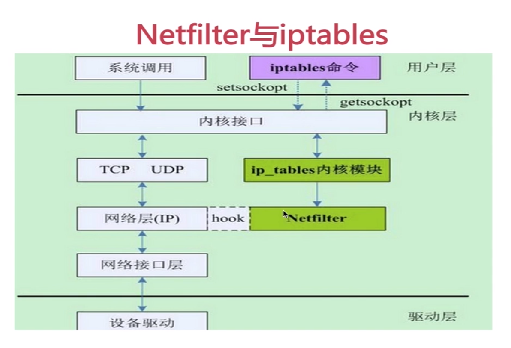

# 第十五週筆記
* 老師家中有事，峯哥代課一週

## 本週主要上課內容
* iptables
    * 如何用 iptables 搭建一套如何企業實際使用的防火牆規則
    * 如何用 iptables 進行防禦攻擊
    * 如何利用 iptables 進行數據包轉發
    * 明白 iptables 的強大及實際使用意義

## linux 指令
* `w`：顯示目前登入使用者相關資訊
```
[user@localhost ~]$ w
 00:33:13 up 3 min,  2 users,  load average: 0.86, 0.53, 0.23
USER 	TTY  	FROM         	LOGIN@   IDLE   JCPU   PCPU WHAT
user 	:0   	:0           	00:30   ?xdm?  27.35s  0.13s /usr/libexec/gnome-ses
user 	pts/0	:0           	00:33	1.00s  0.03s  0.00s w
```
* `iptables -F`：強制清除 iptables 規則

## 什麼是 iptables 
* 常見於 linux 系統下的**應用層**防火牆工具，iptables 用來過濾網路封包，正確的設定 iptables 規則可以有效提升 linux 網路安全，網管人員設定開放哪些 ip 與哪些 port，來阻擋駭客攻擊
* 常用到 iptables 的人員：系統管理人員、網路工程人員、安全人員等等

## 什麼是 netfilter
* 在提到 iptables 之前，我們必須先知道 netfilter 是什麼
* netfilter 是 linux 操作系統核心層內部的一個數據包處理模塊
* 數據包在 netfilter 中的掛載點，我們稱作 **hook point**，分別是 `PRE_ROUTING`、`INPUT`、`OUTPUT`、`FORWARD`、`POST_ROUTING` 這五個
* iptables 與 hook point 的關係<br>
 

## 作業
* iptables 配置
1. **規則一：** 對所有的地址開放本機的 tcp (80、22、10-21) 端口的訪問
2. **規則二：** 允許對所有的地址開放本機的基於 ICMP 協議的數據包訪問
3. **規則三：** 其他未被允許的端口則禁止訪問

* [防火牆地址轉換 SNAT 及 DNAT](https://blog.csdn.net/chengxuyuanyonghu/article/details/64441374)

## 延伸學習
1. [iptables -- 看 imooc](https://www.imooc.com/learn/389)